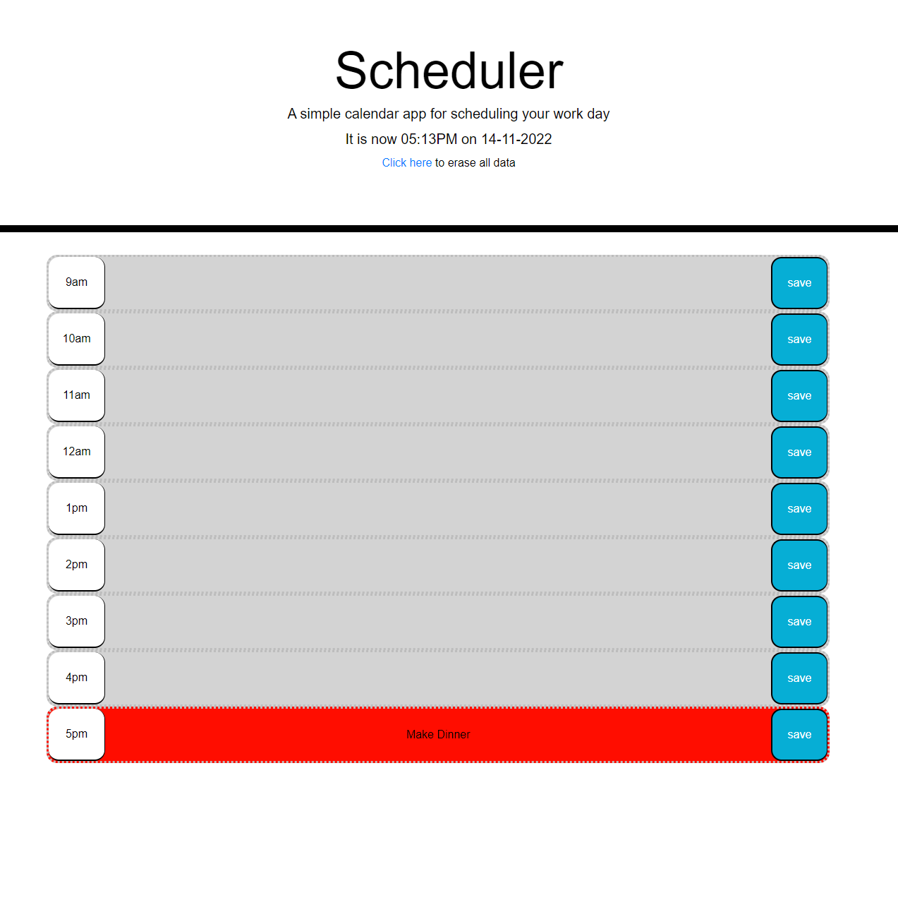

# <Amazing Schedualer>

## Description

- My motivation was to create a flushed out schedualer using local stoarge

- It solved the problem of me being lazy and not having money to buy an actual planner
- I learned how to use local stoarge and how to create elements and adding what i like to it with classListAdd
- [Usage](#usage)  Just click on the link below

## Installation

What are the steps required to install your project? Provide a step-by-step description of how to get the development environment running.

## Usage

Provide instructions and examples for use. Include screenshots as needed.

To add a screenshot, create an `assets/images` folder in your repository and upload your screenshot to it. Then, using the relative filepath, add it to your README using the following syntax:

    

## Credits
I did da work~

## License
---

🏆 The previous sections are the bare minimum, and your project will ultimately determine the content of this document. You might also want to consider adding the following sections.

## Badges

Badges aren't necessary, per se, but they demonstrate street cred. Badges let other developers know that you know what you're doing. Check out the badges hosted by [shields.io](https://shields.io/). You may not understand what they all represent now, but you will in time.

## Features

If your project has a lot of features, list them here.
